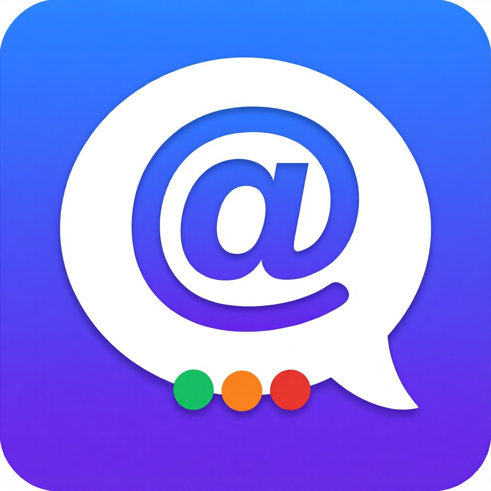

# HarnessChat

**English** | [中文](#中文)

A group-chat desktop app for AI coding harnesses. Pull your agents — Codex, Claude Code, Gemini CLI, Qoder CLI, Cline, Hermes, ZCode, or anything with a CLI — into one WeChat-style group chat, `@`-mention a member to dispatch a task, and watch its output stream back into the room in real time.

> Think of it as a WeChat/QQ group where the members are AI agents running on your own machine.



## Why

Most agent orchestrators in 2026 are worktree/diff/PR centric — they treat agents as code-producing workers. HarnessChat treats them as **chat members**: dispatch work by talking, see everything in one timeline, and keep the transcript searchable in one place.

## Features

- **@-mention dispatch** — `@Codex refactor the README` spawns the harness headlessly in the group workspace; stdout/stderr streams into the task card live.
- **Threads with continuation** — every dispatched task opens a thread; "继续对话" stitches the previous prompt + output tail into the next prompt as working memory.
- **Per-member default model** — each harness has different models with different prices; set the default per member, and override the model on any single message.
- **Custom members via command template** — any CLI agent works: fill in `program` + argument template with `{{prompt}}` / `{{model}}` / `{{cwd}}` placeholders. No code needed.
- **Permission modes per member** — the default mode of every built-in member is a non-bypassing one; yolo/bypass is always a separate, explicit opt-in in Settings.
- **Scrubbed child environment** — members are launched with an allow-listed environment (OS essentials + their own config dirs + proxy), never your whole `process.env`. One harness cannot read another vendor's API key.
- **Workspace as security boundary** — headless members run inside the group workspace directory (a takeover dispatch runs in the dead session's own directory, by design).
- **Local-only + token auth** — the embedded server binds to 127.0.0.1 with a random per-install token; nothing phones home.
- **Session radar & takeover** — reads the transcripts each harness already writes to disk (ZCode, Claude Code, Codex), shows which sessions are still running, gone quiet, or **died mid-task and why** (quota exhausted, auth failure, dropped connection), and hands any of them to another member — *in that session's own working directory*, so the work continues instead of being re-explained.
- **Tray-resident** — closing the window keeps the group working; quit from the tray menu.
- **Bundled Node runtime** — members whose CLI ships as a `.js`/`.cjs` entry (ZCode, Cline via npx) run on the Node embedded in Electron, so a system Node is no longer required.
- **Self-updating** — checks this repo's GitHub Releases on startup and every 30 minutes, then downloads and launches the installer from inside the app.

## Built-in members

| Member | Headless invocation | Notes |
|---|---|---|
| ZCode | `zcode -p` | runs on the app's bundled Node; HarnessChat injects the provider-config paths the ZCode desktop app writes under `~/.zcode/v2` (its own lookup only resolves when launched from the packaged app dir) |
| Claude Code | `claude -p` | |
| Codex | `codex exec` | model comes from its own configured provider (local relays must be running) |
| Gemini CLI | `gemini -p` | |
| Qoder CLI | `qoderclicn -p` | |
| Cline | `cline` via npx | `cline-free/*` models are free |
| Hermes | `hermes -z` | |
| MiniMax Code | `minimax -p` | experimental; the mavis LLM endpoint needs an internal auth-broker lease — see SECURITY of their design |

Detection order: PATH → well-known install locations → manual path override in Settings. Members that aren't found are greyed out, and you can always add your own via the command template.

## Install

```bash
npm install
npm start          # dev
npm run dist       # build Windows installer (NSIS)
```

Requires Node.js ≥ 20 to build. The shipped app carries its own Node (embedded in Electron, currently 24.x), so end users need no Node installation at all.

## Updates

Settings → *Version & updates* shows the running version and a **Check for updates** button; a newer release also raises a banner in the chat header. Downloading writes the installer to `%TEMP%` and launches it, so upgrading is two clicks.

How it decides what is newest:

1. `GET https://api.github.com/repos/chentaoxing/harnesschat/releases/latest` — the repo is public, so no credential is needed.
2. If that call is refused (the anonymous quota is counted per source IP and shared proxies burn it fast), it falls back to `https://github.com/chentaoxing/harnesschat/releases.atom` and resolves the asset link from the release page. Neither route needs a token.
3. Optionally put a token in `%APPDATA%\HarnessChat\github-token.txt` (or set `GH_TOKEN`) to lift the quota. HarnessChat only reads its own data directory and environment variables — it never goes looking for other tools' credentials.

All requests go through Electron's network stack, so a system proxy is honoured automatically; every request has a hard timeout, and a stale download lock is taken over after 5 minutes.

## When one of the harnesses updates

Nothing to do on your side: member commands are re-resolved on every launch (PATH → known install locations → your override in Settings), and per-member model lists are read from each harness's own config at run time. The two exceptions worth knowing:

- The **Cline** member runs through `npx`, so it follows whatever version npx resolves; pin it by editing `cline` in `src/server/adapters.js` (e.g. `cline@3.0.69`) if you want a fixed build.
- **MiniMax Code** is experimental and stays off by default: its `mavis` LLM endpoint requires a lease token issued over the desktop app's internal auth broker, which external callers cannot obtain. Refreshing the OAuth token by opening MiniMax Code is not enough.

## Security

Read [SECURITY.md](SECURITY.md) before daily use. Short version: depending on the permission mode you choose per member, harnesses can read/write files and execute commands **without confirmation** inside the workspace. Only add harnesses you trust.

## Known limitations

- The session radar reads transcript files where each harness puts them; it never writes to another tool's directory, and it only shows harnesses whose layout it recognises (ZCode, Claude Code, Codex today). It reconstructs a session's working directory, its last request and the error it stopped on — enough to hand the work over, not a live re-attach into that harness's own session tree (still on the roadmap).
- Windows is the primary tested platform; macOS/Linux work via `which`-based detection but are less battle-tested. Issues welcome.
- The icon is generated with a Qwen-Image workflow; the build script (`build-icon.js`) packages it reproducibly.

## License

MIT — see [LICENSE](LICENSE).

---

<a id="中文"></a>
# 中文说明

把你的 AI coding harness（Codex / Claude Code / Gemini CLI / Qoder CLI / Cline / Hermes / ZCode，或任何有命令行的 agent）拉进一个**微信风格的群聊**：`@成员` 派任务，输出实时流回群里。

- **@派单**：在群工作区目录里以无头模式拉起对应 harness，stdout/stderr 实时流入任务卡片
- **任务串**：每条派单自动开串，"继续对话"把上文 prompt + 输出尾部拼进下一次任务当工作记忆
- **按成员设默认模型**：各家模型价格不同，逐个设默认值，单条消息也可临时换模型
- **自定义成员**：任意 CLI agent 填 `program` + 参数模板（`{{prompt}}`/`{{model}}`/`{{cwd}}`）即可入群，无需写代码
- **权限模式逐成员可配**，群工作区即安全边界；本地 127.0.0.1 + 随机 token，不上传任何数据
- **托盘常驻**：关窗群继续干活
- **自带 Node 运行时**：ZCode、Cline(npx) 这类 `.js/.cjs` 入口的成员用 Electron 内嵌的 Node 跑，用户机器不装 Node 也能用
- **自动更新**：启动时与每 30 分钟查一次本仓 GitHub Releases，设置里「检查更新」或顶部横幅一键下载安装包

安装：`npm install && npm start`（开发）或 `npm run dist`（打 Windows 安装包）。安全须知见 [SECURITY.md](SECURITY.md)。协议 MIT。

更新与配额：公开仓匿名即可查版本；走共享代理时匿名配额容易耗尽，此时自动回退 `releases.atom`（同样不需要 token）。想彻底摆脱配额，把 token 放进 `%APPDATA%\HarnessChat\github-token.txt` 或设 `GH_TOKEN`——本程序只读自己的数据目录和环境变量，不会去翻别的工具的凭据。
